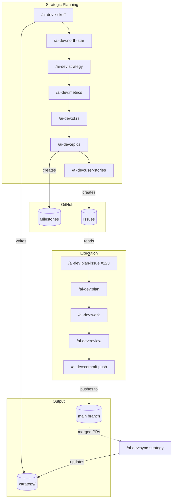

# ai-dev

**Strategic planning meets rapid execution.** A Claude Code plugin that bridges vision-to-code workflows with main-branch development.

## What's Included

- **10 Agents** - Specialized AI agents for orchestration, planning, review, implementation, and research
- **20+ Commands** - Strategic planning, git workflows, quality checks, and execution commands
- **7 Skills** - Reusable knowledge for git, architecture, APIs, testing, performance, and strategic planning
- **Strategy Templates** - Ready-to-use templates for VISION.md, OKRs.md, EPICS.md

## Workflow Overview



## Philosophy

This plugin combines:
- **Strategic Planning** - 8-phase Socratic workflow from problem space to user stories
- **Trunk-Based Development** - All commits to main, no feature branches, small atomic changes
- **GitHub Integration** - Epics → Milestones, User Stories → Issues, bidirectional sync

## Quick Start

### 1. Install the Plugin

```bash
# Clone and install as a Claude Code plugin
git clone https://github.com/drewdresser/ai-dev-settings.git ~/.claude/plugins/ai-dev
```

Or add to your Claude Code settings:
```json
{
  "plugins": ["~/.claude/plugins/ai-dev"]
}
```

### 2. Start Using Commands

```bash
# Strategic planning (full 8-phase workflow)
/ai-dev:kickoff "My Project"

# Bridge GitHub Issue to implementation plan
/ai-dev:plan-issue #42

# Execute a plan with task tracking
/ai-dev:work plans/feature-name.md

# Commit and push to main
/ai-dev:commit-push
```

## Command Reference

### Strategic Planning

| Command | Purpose |
|---------|---------|
| `/ai-dev:kickoff` | Full 8-phase strategic planning workflow |
| `/ai-dev:north-star` | Define vision, mission, and north star |
| `/ai-dev:strategy` | Define strategy and non-goals |
| `/ai-dev:metrics` | Define success metrics and failure thresholds |
| `/ai-dev:okrs` | Create quarterly OKRs |
| `/ai-dev:epics` | Create epics (→ GitHub Milestones) |
| `/ai-dev:user-stories` | Create user stories (→ GitHub Issues) |

### Execution Workflow

| Command | Purpose |
|---------|---------|
| `/ai-dev:plan-issue` | Bridge GitHub Issue → technical plan |
| `/ai-dev:plan` | Interactive technical planning |
| `/ai-dev:work` | Execute plan with TodoWrite tracking |
| `/ai-dev:review` | Multi-agent code review |
| `/ai-dev:sync-strategy` | Sync GitHub → /strategy/ docs |

### Git (Main-Branch Development)

| Command | Purpose |
|---------|---------|
| `/ai-dev:commit` | Create conventional commit (local) |
| `/ai-dev:commit-push` | Commit + push to main with quality gates |
| `/ai-dev:sync` | Pull latest from origin |

### Quality

| Command | Purpose |
|---------|---------|
| `/ai-dev:run-tests` | Run test suite |
| `/ai-dev:lint-fix` | Fix linting issues |
| `/ai-dev:security-scan` | Scan for security issues |

## Workflow: User Story → Shipped Code

```
1. /ai-dev:kickoff "MyProject"
   → Creates /strategy/VISION.md, OKRs.md, EPICS.md
   → Creates GitHub Milestones and Issues

2. /ai-dev:plan-issue #123
   → Reads issue + strategic context
   → Generates plans/issue-123-feature-name.md

3. /ai-dev:work plans/issue-123-feature-name.md
   → TodoWrite task breakdown
   → Incremental commits to main
   → Final push with quality gates

4. /ai-dev:sync-strategy
   → Updates /strategy/ with GitHub state
   → Tracks epic progress
```

## Directory Structure

```
ai-dev-settings/
├── .claude-plugin/
│   └── plugin.json           # Plugin manifest
├── agents/
│   ├── orchestration/        # Master coordinator
│   ├── planning/             # Strategic planner
│   ├── review/               # Code, security, test reviewers
│   ├── implementation/       # Debugger, refactorer, docs
│   └── research/             # Codebase analyst
├── commands/
│   ├── workflows/            # kickoff, plan, work, review
│   ├── strategy/             # north-star, strategy, okrs, epics, user-stories
│   ├── bridge/               # plan-issue, sync-strategy
│   ├── git/                  # commit, commit-push, sync
│   └── quality/              # run-tests, lint-fix, security-scan
├── skills/
│   ├── strategic-planning/
│   ├── managing-git/
│   ├── designing-architecture/
│   └── ...
├── hooks/                    # Event hooks
├── templates/strategy/       # Strategy file templates
└── dashboard/                # Optional: Strategy visualization
```

## Agents

| Agent | Purpose |
|-------|---------|
| `orchestrator` | Coordinates complex multi-step tasks |
| `strategic-planner` | Socratic planning facilitation |
| `code-reviewer` | Code quality assessment |
| `security-auditor` | Security vulnerability analysis |
| `test-architect` | Test design and coverage |
| `debugger` | Error investigation |
| `refactorer` | Code improvement |
| `docs-writer` | Documentation tasks |
| `codebase-analyst` | Project structure analysis |

## Skills

| Skill | Purpose |
|-------|---------|
| `strategic-planning` | Detects and guides planning discussions |
| `managing-git` | Git workflows and trunk-based development |
| `designing-architecture` | Architecture patterns and decisions |
| `analyzing-projects` | Project structure analysis |
| `designing-tests` | Test strategy and patterns |
| `designing-apis` | API design principles |
| `optimizing-performance` | Performance optimization |

## Strategy Dashboard (Optional)

Visualize your strategy across projects:

```bash
uv run python dashboard/server.py
# Open http://localhost:8080
```

## Trunk-Based Development

This plugin emphasizes trunk-based development:

- **All work on main** - No feature branches for solo/small teams
- **Small commits** - Atomic, reversible changes
- **Quality gates** - Tests and lint checks before push
- **Feature flags** - For incomplete features

The `/ai-dev:commit-push` command includes:
- Confirmation prompt for main/master
- Secret scanning
- Test execution
- Linting checks
- Revert instructions after push

## Requirements

- Claude Code CLI
- `gh` CLI (for GitHub integration)
- Git

## License

MIT

## Contributing

See [CONTRIBUTING.md](CONTRIBUTING.md).
